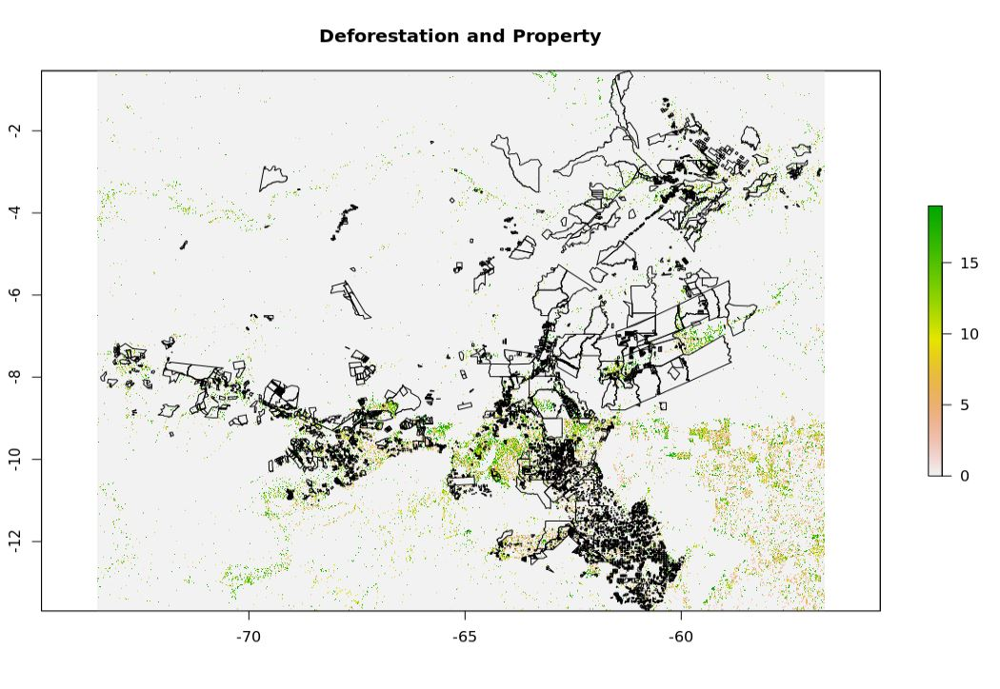
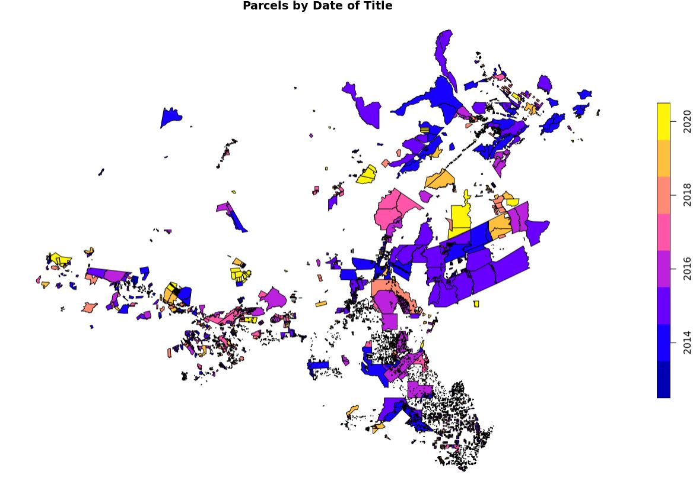
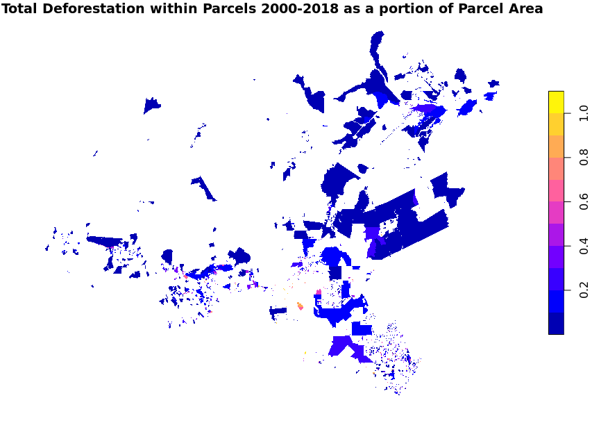
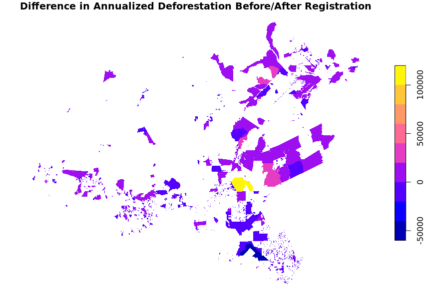
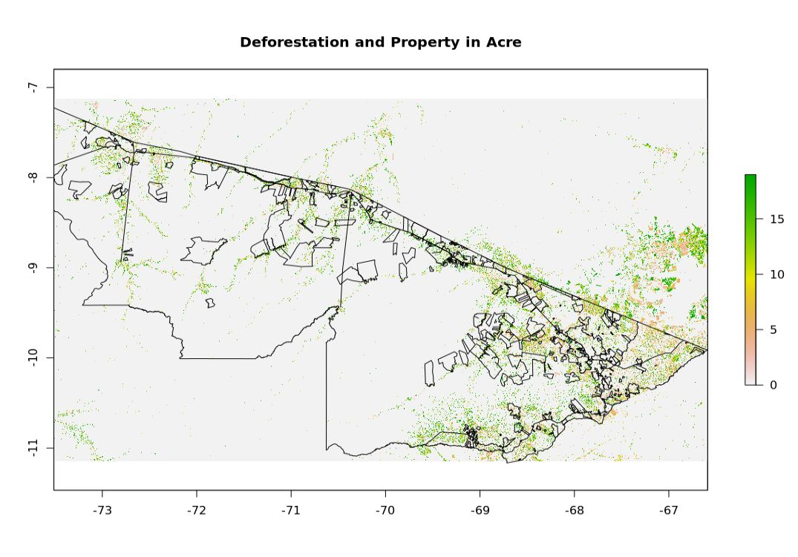

--- 
title: <p style="font-size:40pt"> Governing Infrastructure </p>  
subtitle: <div align="top"> <p style="font-size:24pt">
    Mini-project Presentation 
    </p></div> 
author: "Nick Cuba, Pilar Delpino, Madelyn Rivera and Laura Sauls"
date: <p style="font-size:12pt"> 7/24/2020 </p>
output: 
  slidy_presentation:
    theme: "flatly" 
    footer: "SESYNC Cyber Institute 2020"
--- 

```{r setup, include=FALSE}
knitr::opts_chunk$set(echo = FALSE)
```

## <br/> Background

- Infrastructure - large- and small-scale - key driver of deforestation
- Related to different goals: access to resources (extraction), regional integration, commodities transport
- Re-commitment to infrastructure as key to development - but what effects?

## <br/> Questions and Data
- For today: Can we determine whether titling affects deforestation outcomes in the Brazilian Amazon?
- Data:
  - National property registration data (INCRA)
  - Deforestation by year (Global Forest Watch)
  - Administrative boundaries (national, state, municipality)
  - Roads

--- 

<br/> <br/> <br/> 
<br/> <br/> <br/>
<br/> <br/> <br/>
<div align="center"> <p style="font-size:48pt">
Initial Results </p> </div> 

--- 

<br/> 
<p align="center">
{#id.class width=70% height=70%} </p>

--- 

<br/>
<p align="center">
{#id.class width=70% height=70%} </p>

--- 

<br/> 
<p align="center">
{#id.class width=70% height=70%} </p>

--- 

<br/>
<p align="center">
{#id.class width=70% height=70%} </p>


--- 


<br/>
<p align="center">
{#id.class width=80% height=80%} </p>


--- 

<br/>
<p align="center">
{#id.class width=70% height=70%} </p>

--- 

<br/> 
<br/> 
<br/> 
<br/>
<br/>
<br/> 
<br/> 
<br/>
<div align="center"> <p style="font-size:48pt">
Thank you! </p> </div> 
<br/>
<br/>
<br/>
<div align="center"> <p style="font-size:20pt">
Follow us on Twitter! 
<br/>
@ExtractivesCU and @prisma_org</p></div>

